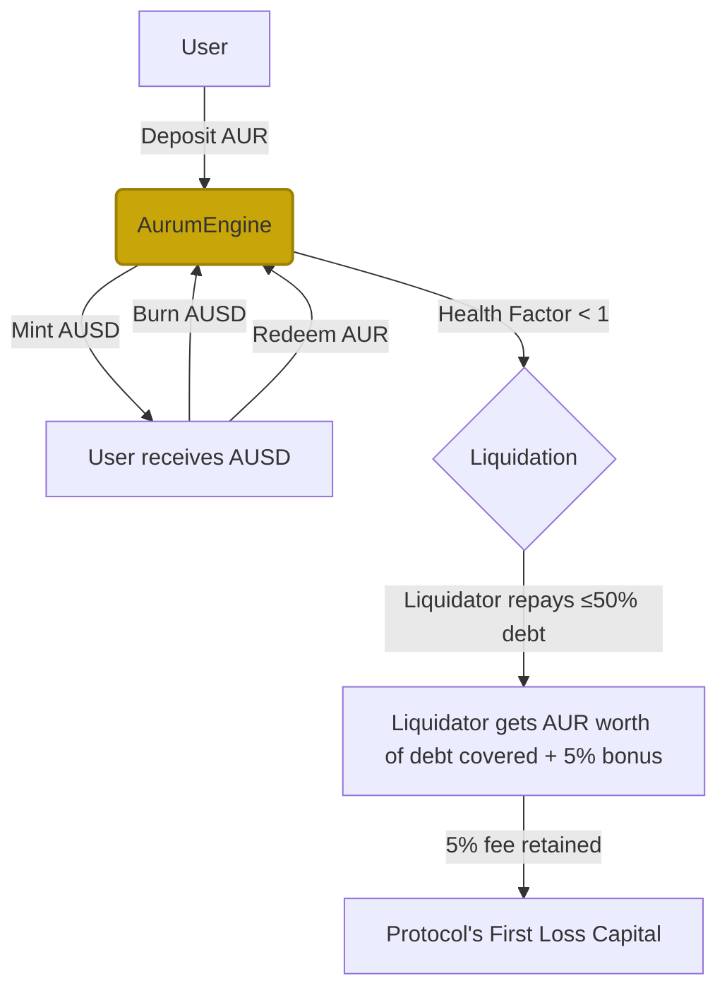
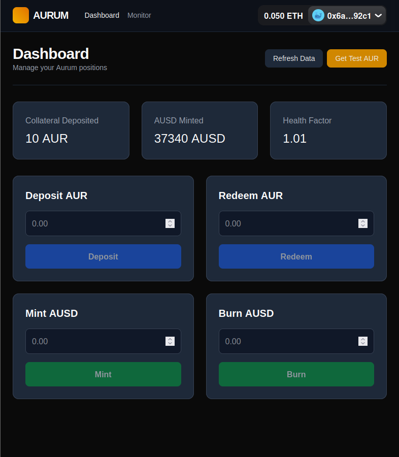
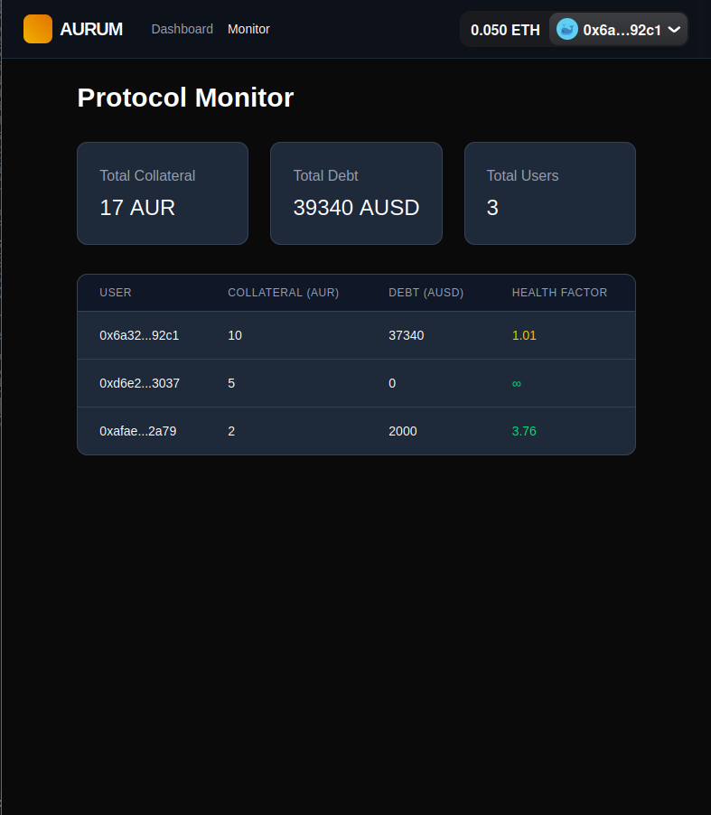

<!-- omit in toc -->
## Aurum Protocol
[](https://opensource.org/licenses/MIT)
[](https://getfoundry.sh/)
[](https://soliditylang.org/)
[](https://sepolia.etherscan.io)

<!-- omit in toc -->
## Table of Contents
- [Overview](#overview)
- [Components](#components)
- [Design Choices](#design-choices)
- [Frontend Features](#frontend-features)
- [Technical Stack](#technical-stack)
- [Getting Started](#getting-started)
  - [Prerequisites](#prerequisites)
    - [For Only Viewing the Frontend Locally](#for-only-viewing-the-frontend-locally)
    - [To Optionally Deploy the Backend/Smart Contracts Yourself](#to-optionally-deploy-the-backendsmart-contracts-yourself)
  - [Clone the Repository](#clone-the-repository)
  - [View the Frontend](#view-the-frontend)
  - [Using the Dashboard](#using-the-dashboard)
  - [Deploy the Smart Contracts (Sepolia)](#deploy-the-smart-contracts-sepolia)
- [Security](#security)
- [Diagrams \& Visuals](#diagrams--visuals)
  - [Protocol Capital Flow Diagram](#protocol-capital-flow-diagram)
  - [UI Screenshots](#ui-screenshots)
- [Links And References](#links-and-references)
- [License](#license)


## Overview
This project is a modified and extended version of Cyfrin Updraft's Advanced Foundry course's DeFi Stablecoin project. The Cyfrin project focused on building a stablecoin loosely similar to MakerDAO's DAI and made their stablecoin exogenously backed by wETH and wBTC, with a 200% collateralization ratio. I took the Cyfrin project and added my own spin to it by making four key changes. One, I changed the collateral from a multi-asset (wETH and wBTC) to a single asset—specifically tokenized gold. Two, I adjusted the collateralization ratio from 200% (50% LTV) to 125% (80% LTV) to account for gold's historical stability and decreased volatility. Three, I added a liquidation close factor to protect users from getting completely liquidated over minor dips (e.g., 2% dips). Four, I added a max supply constant to accommodate for risks associated with real world assets. In addition to the protocol design changes, I created a frontend, including a dashboard (and a collateral faucet) for users to interact with the protocol and a monitor to view user and protocol statistics. 

Focusing on capital efficiency, the Aurum Protocol is a decentralized, over-collateralized stablecoin system that is backed by tokenized gold. This system allows users to deposit tokenized gold (AUR) to mint the Aurum USD (AUSD) stablecoin, which is pegged to $1 USD.


## Components
The Aurum Protocol consists of three core components:
- **AurumGold (AUR)**: An ERC20 token representing tokenized gold, used as collateral.
- **AurumUSD (AUSD)**: The decentralized, algorithmic stablecoin pegged to the US Dollar.
- **AurumEngine**: The core smart contract that handles depositing and redeeming collateral, minting and burning AUSD, and liquidations.


## Design Choices
This protocol is specifically designed for gold, an asset with significantly lower volatility than typical cryptocurrencies (like ETH or BTC). Since gold is historically stable, the Aurum Protocol utilizes an 80% LTV ratio to offer users higher capital efficiency, allowing users to buy more AUSD with less collateral. Users only need to deposit 125% of the value of the AUSD they wish to mint, compared to 150%+ required for volatile crypto assets, or the 200% in the original Cyfrin design.

To protect users from "cascade liquidations" during minor market wicks (e.g., a sudden 1-2% drop), I implemented a 50% Close Factor. In this design, liquidators are restricted to covering a maximum of 50% of a user's debt in a single transaction. This is beneficial to users as it provides a "grace period" to add more collateral or repay debt before a second liquidation occurs, preventing total liquidation over small price dips.

Additionally, the protocol adds a safety mechanism to act as in-built insurance: liquidation fees. Whenever users get liquidated, along with paying a 5% bonus to liquidators, the protocol takes a 5% fee. These liquidation fees are retained within the protocol's balance rather than being immediately paid out to an external treasury. This accumulated collateral acts as "First Loss Capital." It creates a reserve buffer that increases the global solvency of the protocol during extreme market volatility or "Black Swan" events.


## Frontend Features
- **Dashboard**: Manage depositing and redeeming AUR, minting and burning AUSD, and view your health factor.
- **Monitor Page**: View protocol-wide statistics (TVL, total debt, and user count) and a table of all users with color‑coded health factors.
- **Faucet**: Get 10 test AUR tokens with one button click.
- **Navigation Bar**: Easily switch between the 'Dashboard' and the 'Monitor' pages and easily change your wallet account.


## Technical Stack
- **Languages**: Solidity ^0.8.18, TypeScript
- **Framework**: Foundry
- **Oracles**: Chainlink Price Feeds (XAU/USD)
- **Token Standards**: ERC20 (OpenZeppelin)
- **Frontend**: React, Next.js, Wagmi, Viem, RainbowKit, TailwindCSS, TanStack Query


## Getting Started
To only view the Aurum Protocol frontend without cloning the repository, visit this link: https://aurum-protocol.vercel.app/.

To view the Aurum Protocol frontend locally (and optionally deploy the smart contracts yourself), follow the directions below.

### Prerequisites
#### For Only Viewing the Frontend Locally
- Node.js (v18+) and npm
- A WalletConnect project ID (see [WalletConnect](https://dashboard.walletconnect.com/sign-in))
- A `.env` file for `aurum-frontend/`

#### To Optionally Deploy the Backend/Smart Contracts Yourself
- [Foundry](https://getfoundry.sh/)
- A keystore account created with `cast wallet import` (see [Foundry Documentation](https://www.getfoundry.sh/cast/wallet-operations#create-a-keystore))
- An RPC URL for Sepolia (e.g., from [Alchemy](https://www.alchemy.com/) or [Infura](https://infura.io/))
- An Etherscan API key for contract verification (see [Etherscan](https://etherscan.io/login))
- A `.env` file for `aurum-backend/`

  
### Clone the Repository
```bash
git clone https://github.com/vridhib/aurum-protocol
cd aurum-protocol
```


### View the Frontend
Copy the variable in `aurum-frontend/.env.example` to `aurum-frontend/.env` and fill in your project ID. This WalletConnect project ID is required for the frontend to function. 
```bash
NEXT_PUBLIC_WALLETCONNECT_PROJECT_ID=your_walletconnect_project_id
```
Then, run the following commands:
```bash
cd aurum-frontend
npm install
npm run dev
```
Now, open http://localhost:3000 to use the dashboard.

### Using the Dashboard
Connect your wallet (e.g., MetaMask) to Sepolia and start using the dashboard. To acquire test AUR, simply click the 'Get Test AUR' button in the header; it will send you 10 AUR from the AurumGoldFaucet contract. To view the current users and their metrics as well as the protocol's metrics click on 'Monitor' in the navigation bar. 


### Deploy the Smart Contracts (Sepolia)
To deploy the contracts yourself, follow the directions below.

Copy the variables in `aurum-backend/.env.example` to `aurum-backend/.env` and fill in your values:
```
ETHERSCAN_API_KEY=your_etherscan_key
SEPOLIA_RPC_URL=your_rpc_url
SEPOLIA_DEPLOYER_ACCOUNT=address_associated_with_your_keystore_account
```

Modify `aurum-backend/Makefile` and replace `sepolia-deployer` with the name of your keystore account (e.g., `my-account`). Ensure that your keystore account is funded with SepoliaETH.
```bash
deploy-gold-token:
	@forge script script/DeployAurumGold.s.sol:DeployAurumGold --rpc-url $(SEPOLIA_RPC_URL) --account sepolia-deployer --broadcast --verify --etherscan-api-key $(ETHERSCAN_API_KEY) -vvvv

deploy-ausd:
	@forge script script/DeployAUSD.s.sol:DeployAUSD --rpc-url $(SEPOLIA_RPC_URL) --account sepolia-deployer --broadcast --verify --etherscan-api-key $(ETHERSCAN_API_KEY) -vvvv

deploy-aur-faucet:
	@forge script script/DeployAurumGoldFaucet.s.sol:DeployAurumGoldFaucet --rpc-url $(SEPOLIA_RPC_URL) --account sepolia-deployer --broadcast --verify --etherscan-api-key $(ETHERSCAN_API_KEY) -vvvv 
```

Verify that the contracts compile properly and pass all tests:
```bash
cd aurum-backend
forge build
forge test
```

Deploy the collateral token:
```bash
make deploy-gold-token
```

Modify `aurum-backend/script/HelperConfig.s.sol` and replace `aurumGold` with your deployed contract address:
```solidity
    function getSepoliaEthConfig() public view returns (NetworkConfig memory) {
        address sepoliaDeployerAccount = vm.envAddress("SEPOLIA_DEPLOYER_ACCOUNT");

        return NetworkConfig({
            goldUsdPriceFeed: 0xC5981F461d74c46eB4b0CF3f4Ec79f025573B0Ea,
            aurumGold: "your token address",             
            deployerAccount: sepoliaDeployerAccount                        
        });
    }
```
 
Deploy the engine and stablecoin:
```bash
make deploy-ausd
```

Deploy the faucet:
```bash
make deploy-aur-faucet
```

Modify `aurum-frontend/src/config/constants.ts` and update the following address constants to use your deployed contract addresses:
```ts
export const AURUM_ENGINE_ADDRESS = getAddress("0x471c1d6f2c8d9883d051f296429bcadb4eb4dc11");
export const AUR_GOLD_ADDRESS = getAddress("0x7769F56edC2a1882a51cec1d3c96F31482b5A241");
export const AURUM_AUSD_ADDRESS = getAddress("0x3828120d97913be56ded3522a9d0926cd79d9fb2");
export const AUR_FAUCET_ADDRESS = getAddress("0x25067322310e834498b1638423383b3e5603dd30");
```
     
## Security 
This project includes Invariant Fuzzing tests to ensure the protocol remains overcollateralized under random conditions. It tests three conditions: the protocol must always be overcollateralized, getter functions should not revert, and the total supply should never exceed the max supply. The core smart contracts have over 90% test coverage. It is to be noted that this protocol is unaudited—if you choose to deploy this to the Mainnet or L2s, do it at your own risk.


## Diagrams & Visuals
### Protocol Capital Flow Diagram

### UI Screenshots



## Links And References
- [AurumGold on Sepolia Etherscan](https://sepolia.etherscan.io/address/0x7769F56edC2a1882a51cec1d3c96F31482b5A241)
- [AurumGoldFaucet on Sepolia Etherscan](https://sepolia.etherscan.io/address/0x25067322310e834498b1638423383b3e5603dd30)
- [AurumUSD on Sepolia Etherscan](https://sepolia.etherscan.io/address/0x3828120d97913be56ded3522a9d0926cd79d9fb2)
- [AurumEngine on Sepolia Etherscan](https://sepolia.etherscan.io/address/0x471c1d6f2c8d9883d051f296429bcadb4eb4dc11)
- [Vercel Deployment Link](https://aurum-protocol.vercel.app/)
- [Cyfrin Updraft Course](https://updraft.cyfrin.io/courses/advanced-foundry)
- [Original Cyfrin Project](https://github.com/Cyfrin/foundry-defi-stablecoin-cu)


## License
This project is licensed under the MIT License. See the [full license text](https://opensource.org/licenses/MIT) for details.