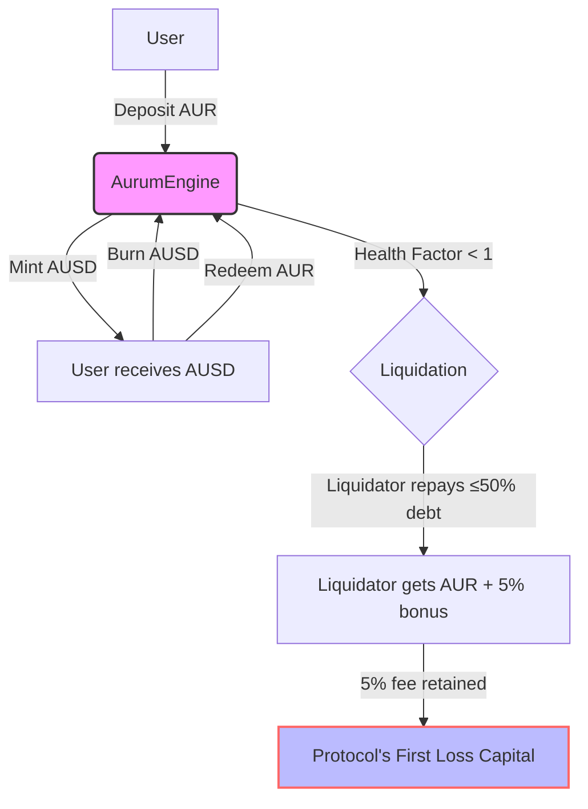
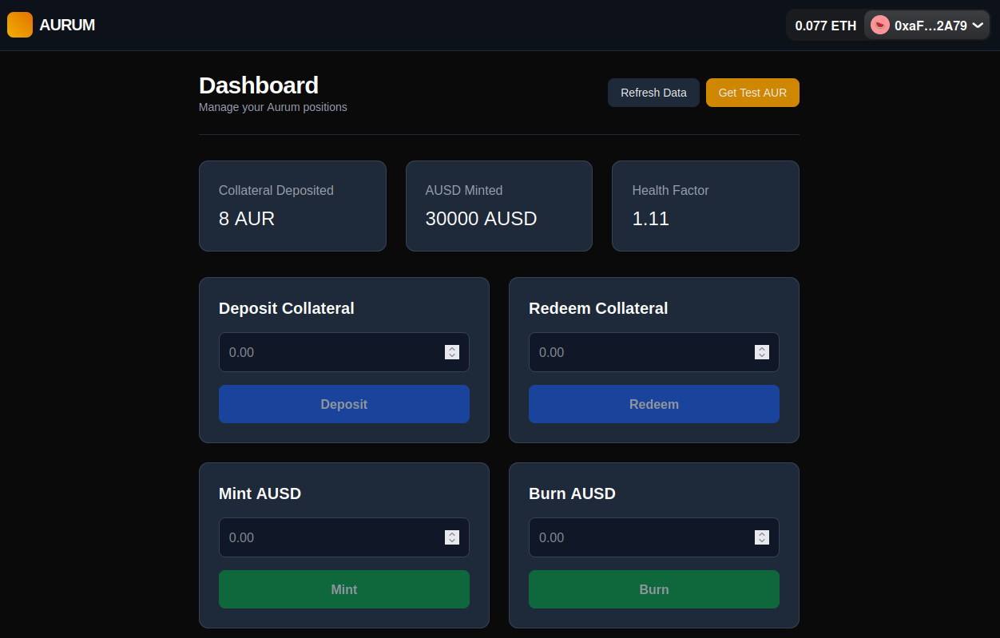

<!-- omit in toc -->
## Aurum Protocol
[](https://opensource.org/licenses/MIT)
[](https://getfoundry.sh/)
[](https://soliditylang.org/)
[](https://sepolia.etherscan.io)

<!-- omit in toc -->
## Table of Contents
- [Overview](#overview)
- [Components](#components)
- [Design Choices](#design-choices)
- [Technical Stack](#technical-stack)
- [Getting Started](#getting-started)
  - [Prerequisites](#prerequisites)
  - [Clone the Repository](#clone-the-repository)
  - [Backend (Smart Contracts)](#backend-smart-contracts)
  - [Frontend (Dashboard)](#frontend-dashboard)
  - [Using the Dashboard](#using-the-dashboard)
  - [Deployment (Sepolia)](#deployment-sepolia)
- [Security](#security)
- [Diagrams \& Visuals](#diagrams--visuals)
- [Links And References](#links-and-references)
- [License](#license)


## Overview
This project is a modified and extended version of the Cyfrin Updraft's Advanced Foundry course's DeFi Stablecoin project. The Cyfrin project focused on building a stablecoin loosely similar to MakerDAO's DAI and made their stablecoin exogenously backed by wETH and wBTC, with a 200% collateralization ratio. I took the Cyfrin project and added my own spin to it by making four key changes. One, I changed the collateral from a multi-asset (wETH and wBTC) to a single asset--specifically tokenized gold. Two, I adjusted the collateralization ratio from 200% (50% LTV) to 125% (80% LTV) to account for gold's historical stability and decreased volatility. Three, I added a liquidation close factor to protect users from getting completely liquidated over minor dips (e.g., 2% dips). Four, I added a max supply constant to accommodate for risks associated with real world assets. In addition to the protocol design changes, I created a frontend dashboard for users to interact with the protocol. 

Focusing on capital efficiency, the Aurum Protocol is a decentralized, over-collateralized stablecoin system that is backed by tokenized gold. This system allows users to deposit tokenized Gold (AUR) to mint the Aurum USD (AUSD) stablecoin, which is pegged to $1 USD.


## Components
The Aurum Protocol consists of three core components:
- **AurumGold (AUR)**: An ERC20 token representing tokenized Gold, used as collateral.
- **AurumUSD (AUSD)**: The decentralized, algorithmic stablecoin pegged to the US Dollar.
- **AurumEngine**: The core smart contract that handles depositing collateral, minting, burning, and liquidations.


## Design Choices
This protocol is specifically designed for Gold, an asset with significantly lower volatility than typical cryptocurrencies (like ETH or BTC). Since Gold is historically stable, the Aurum Protocol utilizes an 80% LTV ratio to offer users higher capital efficiency, allowing users to buy more AUSD with less collateral. Users only need to deposit 125% of the value of the AUSD they wish to mint, compared to 150%+ required for volatile crypto assets, or the 200% in the original Cyfrin design.

To protect users from "cascade liquidations" during minor market wicks (e.g., a sudden 1-2% drop), I implemented a 50% Close Factor. In this design, liquidators are restricted to covering a maximum 50% of a user's debt in a single transaction. This is beneficial to users as it provides a "grace period" to add more collateral or repay debt before a second liquidation occurs, preventing total liquidation over small price dips.

Additionally, the protocol adds a safety mechanism to act as in-built insurance: liquidation fees. Whenever users get liquidated, along with paying a 5% bonus to liquidators, the protocol takes a 5% fee. These liquidation fees are retained within the protocol's balance rather than being immediately paid out to an external treasury. This accumulated collateral acts as "First Loss Capital." It creates a reserve buffer that increases the global solvency of the protocol during extreme market volatility or "Black Swan" events.


## Technical Stack
- **Languages**: Solidity ^0.8.18, TypeScript
- **Framework**: Foundry
- **Oracles**: Chainlink Price Feeds (XAU/USD)
- **Token Standards**: ERC20 (OpenZeppelin)
- **Frontend**: Wagmi, Viem, RainbowKit, TailwindCSS, TanStack Query


## Getting Started
### Prerequisites
- [Foundry](https://getfoundry.sh/)
- Node.js (v18+) and npm
- An RPC URL for Sepolia (e.g., from [Alchemy](https://www.alchemy.com/) or [Infura](https://infura.io/))
- A `.env` file with:
  
```bash
SEPOLIA_RPC_URL=your_rpc_url
ETHERSCAN_API_KEY=your_etherscan_key
PRIVATE_KEY=your_deployer_private_key
```

### Clone the Repository
```bash
git clone https://github.com/your-username/aurum-protocol
cd aurum-protocol
```

### Backend (Smart Contracts)
```bash
cd aurum-backend
forge build
forge test
```

### Frontend (Dashboard)
```bash
cd ../aurum-frontend
npm install
npm run dev
```
Now open http://localhost:3000 to use the dashboard.

### Using the Dashboard
Connect your wallet (e.g., MetaMask) to Sepolia and start using the dashboard. To get test AUR, simply click the Get Test AUR button in the header – it will send you 10 AUR from the AurumGoldFaucet contract.


### Deployment (Sepolia) 
Deploy the collateral token:

```bash
make deploy-gold-token
```
 
Deploy the Engine and Stablecoin:

```bash
make deploy-ausd
```

Deploy the Faucet:
```bash
make deploy-faucet
```
     
## Security 
This project includes Invariant Fuzzing tests to ensure the protocol remains overcollateralized under random conditions. It tests three conditions: the protocol must always be overcollateralized, getter functions should not revert, and the total supply should never exceed the max supply. The core smart contracts have over 90% test coverage. It is to be noted that this protocol is unaudited--if you choose to deploy this to the Mainnet or L2s, do it at your own risk.


## Diagrams & Visuals



 

## Links And References
- [AurumGold on Sepolia Etherscan](https://sepolia.etherscan.io/address/0x7769F56edC2a1882a51cec1d3c96F31482b5A241)
- [AurumGoldFaucet on Sepolia Etherscan](https://sepolia.etherscan.io/address/0x25067322310e834498b1638423383b3e5603dd30)
- [AurumUSD on Sepolia Etherscan](https://sepolia.etherscan.io/address/0x9C707127B1c8ab786E23474BCa253948Bae1B452)
- [AurumEngine on Sepolia Etherscan](https://sepolia.etherscan.io/address/0x57dd5e001cD51689cDA9F38Ca49D841923cD5012)
- [Cyfrin Updraft Course](https://updraft.cyfrin.io/courses/advanced-foundry)
- [Original Cyfrin Project]( https://github.com/Cyfrin/foundry-defi-stablecoin-cu)


## License
This project is licensed under the MIT License. See the [full license text](https://opensource.org/licenses/MIT) for details.