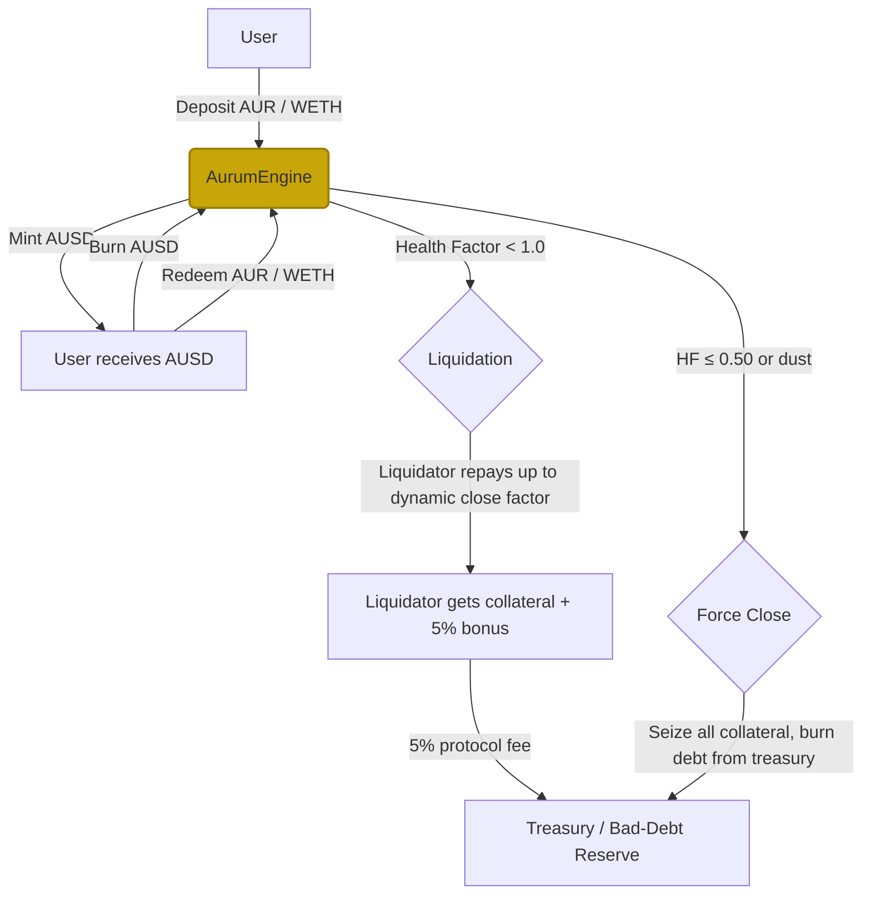
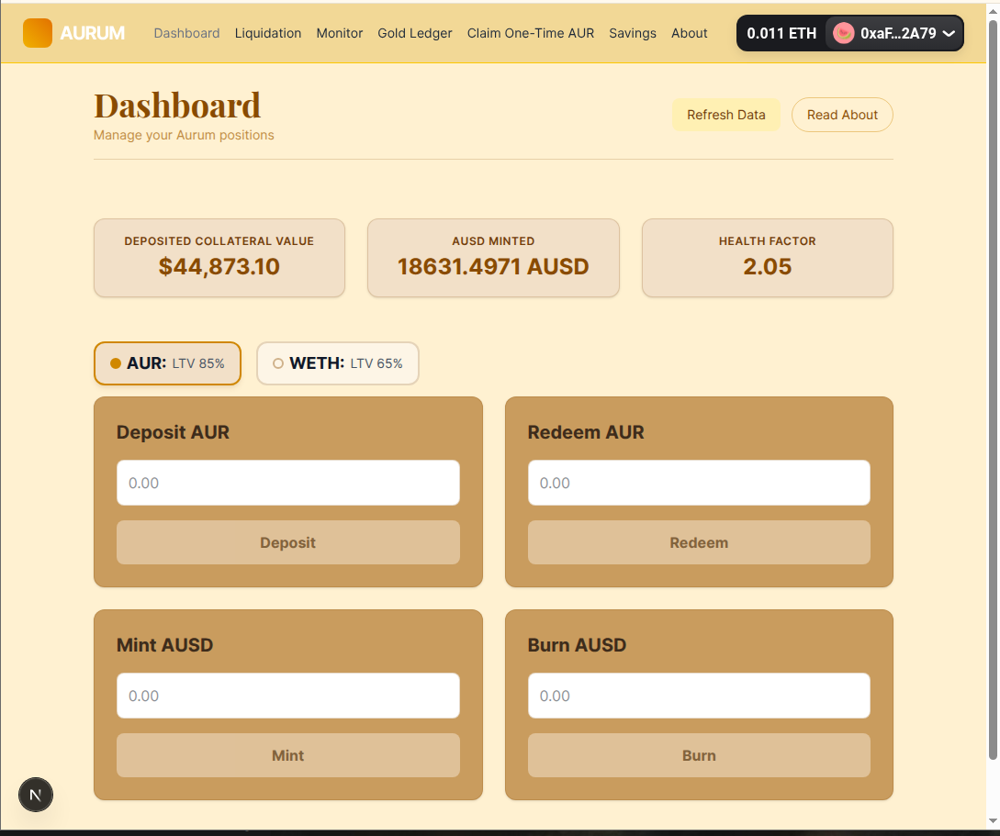
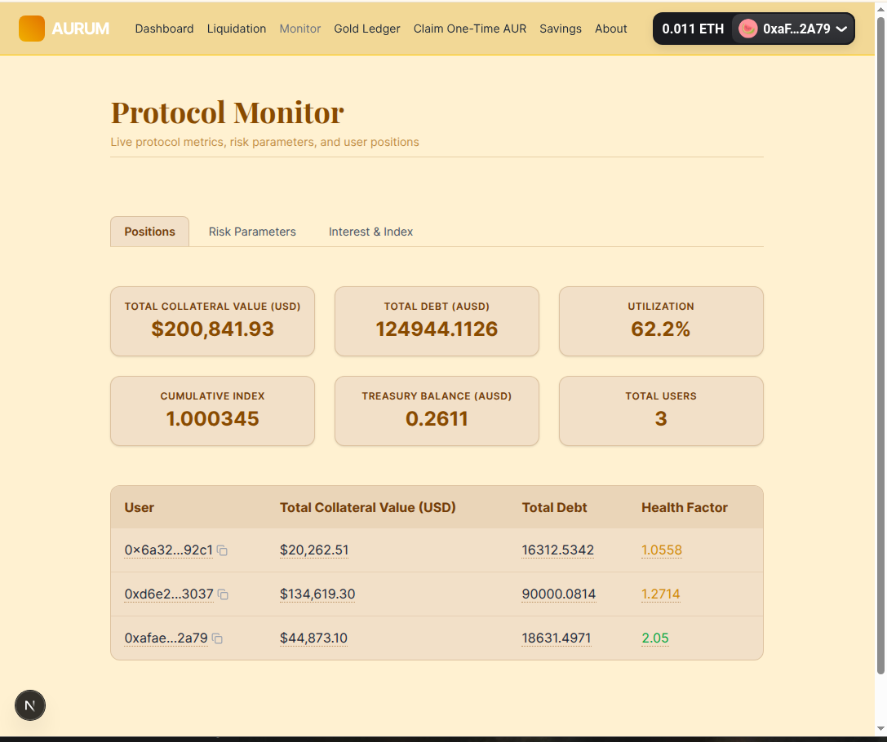
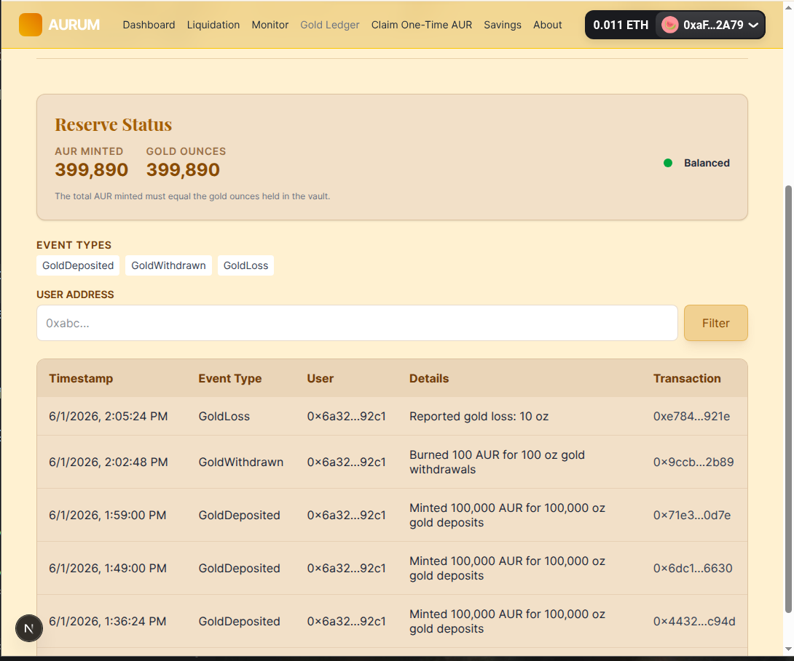
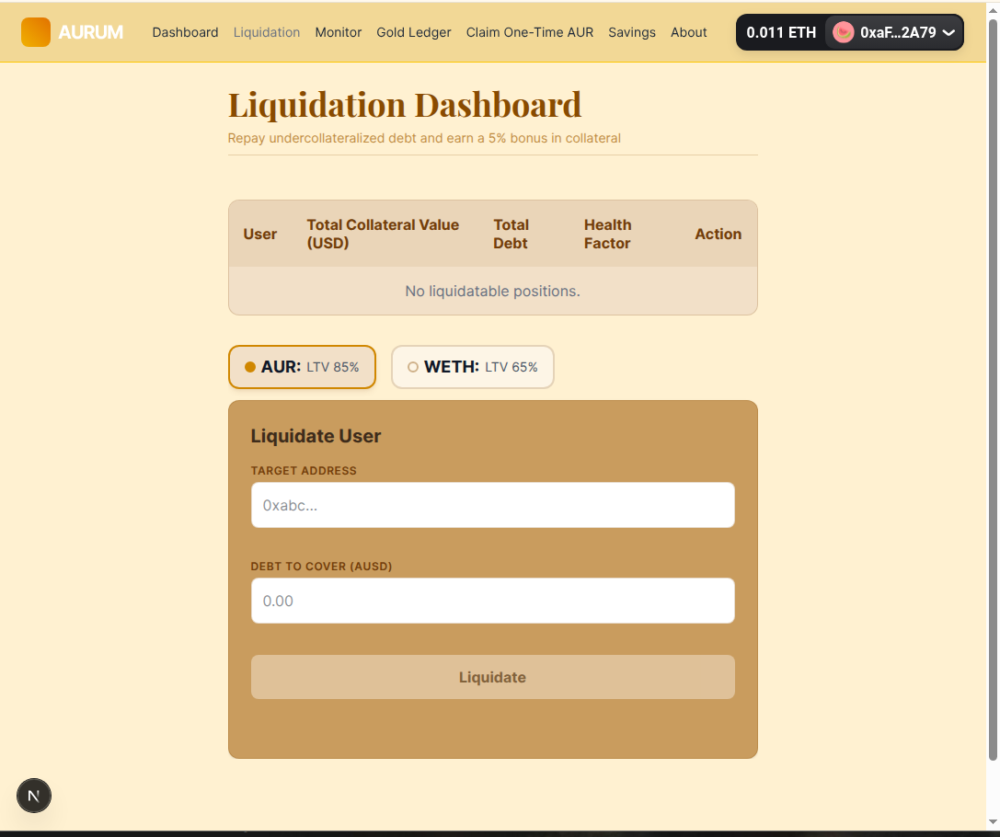
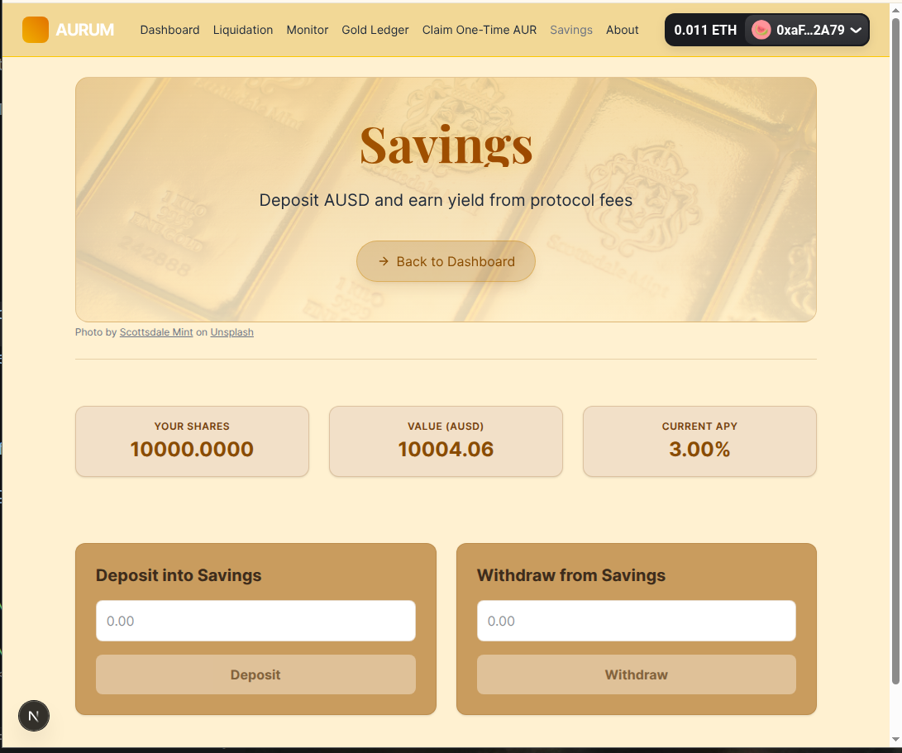

<!-- omit in toc -->
## Aurum V2: Multi‑Collateral Stablecoin System with a Volatility‑Driven LTV, Kinked Interest Rate Model, Proportional Debt Allocation, & Full Frontend (Built with Foundry & Deployed on Sepolia)
[](https://opensource.org/licenses/MIT)
[](https://getfoundry.sh/)
[](https://soliditylang.org/)
[](https://sepolia.etherscan.io)

<!-- omit in toc -->
## Table of Contents
- [Why This Project](#why-this-project)
- [Links And References](#links-and-references)
- [Diagrams \& Visuals](#diagrams--visuals)
  - [Protocol Capital Flow Diagram](#protocol-capital-flow-diagram)
  - [UI Screenshots](#ui-screenshots)
- [Security](#security)
  - [Code Coverage](#code-coverage)
- [Self-Audit \& Security Hardening](#self-audit--security-hardening)
  - [AurumEngine: Event Parameter Gaps](#aurumengine-event-parameter-gaps)
  - [AurumGold: Inherited Burn Functions Were Unrestricted](#aurumgold-inherited-burn-functions-were-unrestricted)
  - [AurumUSD: Inherited `burnFrom` was Unrestricted (Legacy from the Original DSC Project)](#aurumusd-inherited-burnfrom-was-unrestricted-legacy-from-the-original-dsc-project)
  - [Oracle Infrastructure Gaps](#oracle-infrastructure-gaps)
  - [Protocol Invariant Test Logic](#protocol-invariant-test-logic)
- [Architecture Overview](#architecture-overview)
- [Key Design Choices](#key-design-choices)
  - [Multi-Collateral Support](#multi-collateral-support)
  - [Automatic Per-Collateral Debt Allocation](#automatic-per-collateral-debt-allocation)
  - [Interest Rate Model Using a Kinked Utilization Curve](#interest-rate-model-using-a-kinked-utilization-curve)
  - [Dynamic LTV Using a Volatility Oracle](#dynamic-ltv-using-a-volatility-oracle)
    - [Oracle Implementation](#oracle-implementation)
    - [Testnet Oracle Configuration](#testnet-oracle-configuration)
  - [Dynamic Close Factor](#dynamic-close-factor)
  - [Liquidation Profit](#liquidation-profit)
  - [Bad Debt Reserve \& Force Close](#bad-debt-reserve--force-close)
  - [Conditional Pausability](#conditional-pausability)
  - [Slippage Protections on Redemptions](#slippage-protections-on-redemptions)
- [Design Trade‑offs \& Known Limitations](#design-tradeoffs--known-limitations)
  - [Owner‑Controlled Parameter Updates (`setCollateralInfo`)](#ownercontrolled-parameter-updates-setcollateralinfo)
  - [Testnet Volatility Oracles](#testnet-volatility-oracles)
- [Frontend Features](#frontend-features)
- [Technical Stack](#technical-stack)
- [Getting Started](#getting-started)
  - [Prerequisites](#prerequisites)
    - [For Only Viewing the Frontend Locally](#for-only-viewing-the-frontend-locally)
    - [To Optionally Deploy the Backend/Smart Contracts Yourself](#to-optionally-deploy-the-backendsmart-contracts-yourself)
  - [Clone the Repository](#clone-the-repository)
  - [View the Frontend](#view-the-frontend)
  - [Using the Dashboard](#using-the-dashboard)
  - [Deploy the Smart Contracts (Sepolia)](#deploy-the-smart-contracts-sepolia)
- [Planned Features](#planned-features)
- [License](#license)

<!-- omit in toc -->
## What Makes This Protocol Stand Out
> - Built for institutional RWA tokenization
> - Full audit trail via on‑chain gold ledger
> - Volatility‑aware risk parameters
> - 100+ unit/invariant tests, fuzzing, and an iterative self‑audit/security hardening process


## Why This Project

Tokenized gold surpassed $[5.25 billion](https://www.forbes.com/digital-assets/categories/tokenized-gold/), in May 2026, due to institutional demand for real-world assets on-chain. In the US, the CLARITY Act is paving the way for regulated stablecoins, and major banks are actively piloting gold-collaterized lending assets. At the same time, the broader stablecoin market has grown to over [$325 billion](https://coinmarketcap.com/view/stablecoin/), with fintech companies and traditional banks starting to to launch their own on-chain dollars.

Despite this growth, most DeFi lending protocols treat gold as just another volatile ERC-20 and ignore its unique risk profile. Aurum was built to demonstrate that gold should have a custom risk infrastructure: custom LTV curves, oracle-driven close factors, and an immutable audit trail that ties every token to the physical ounces held in reserve. 


## Links And References
- [Vercel Deployment Link](https://aurum-protocol.vercel.app/)
- [AurumGold on Sepolia Etherscan](https://sepolia.etherscan.io/address/0xa07ad08f298c7e8a2b432f7d25b86fe7e101902b#code)
- [AurumGoldFaucet on Sepolia Etherscan](https://sepolia.etherscan.io/address/0x3ff3edfc64d8be337c051492824aa8ce823cfad1#code)
- [AurumUSD on Sepolia Etherscan](https://sepolia.etherscan.io/address/0xde76cf5c4f6d0b6687f0ebf460cdf9468744c8c7#code)
- [AurumEngine on Sepolia Etherscan](https://sepolia.etherscan.io/address/0xfc243b4040002d4a9fc3ec412af04eaa2f0da525#code)
- [AurumInterestRateModel on Sepolia Etherscan](https://sepolia.etherscan.io/address/0x3d719281d30b4a1e6a7053f62e18477612f730df#code)
- [AurumSavings on Sepolia Etherscan](https://sepolia.etherscan.io/address/0xafc5ec7e1a35b85f91f540284ddb253832528180#code)
- [AurumTreasury on Sepolia Etherscan](https://sepolia.etherscan.io/address/0x8d95b5282b7f94ce5d4dc5bdc946d8ef180f4297#code)
- [Aurum V1](https://github.com/vridhib/aurum-protocol/releases/tag/v1.0.0)
- [Cyfrin Updraft Course](https://updraft.cyfrin.io/courses/advanced-foundry)
- [Original Cyfrin Project](https://github.com/Cyfrin/foundry-defi-stablecoin-cu)

## Diagrams & Visuals
### Protocol Capital Flow Diagram

```mermaid
graph TD
    A[User] -->|Deposit AUR / WETH| B(AurumEngine)
    B -->|Mint AUSD| C[User receives AUSD]
    C -->|Burn AUSD| B
    C -->|Redeem AUR / WETH| B
    B -->|Health Factor < 1.0| D{Liquidation}
    D -->|Liquidator repays up to dynamic close factor| E[Liquidator gets collateral + 5% bonus]
    E -->|5% protocol fee| F[Treasury / Bad‑Debt Reserve]
    B -->|HF ≤ 0.50 or dust| G{Force Close}
    G -->|Seize all collateral, burn debt from treasury| F
    style B fill:#C8A509,stroke:#9C8107,stroke-width:2px
```
### UI Screenshots







## Security 

The protocol employs multiple layered safeguards:
- Over-collateralization enforced on all state-changing operations
- Stale price feed detection via OracleLib
- Chainlink Automation for continuous index and LTV updates
- Minimum liquidation profit protection for keepers
- Conditional pausability with objective criteria
- Bad debt reserve as a systemic backstop
- Slippage protection on redemptions

This protocol has invariant fuzzing tests to ensure the security of the system. It tests four conditions: 
1. The protocol must always be overcollateralized,
2. The `user actual debt = Σ normalized * index / 1e18`
3. Getter functions should not revert
4. The cumulative index never decreases. 

### Code Coverage
95% line coverage, 82% branch coverage (117 tests). Remaining uncovered branches are predominantly unreachable or require extreme economic states impractical to simulate in unit tests. Note that the listed untested branches have been tested but are marked as untested by the `forge coverage` command.

The core smart contracts have over 90% test coverage. It is to be noted that this protocol is unaudited—so if you choose to deploy this to the Mainnet or L2s, do it at your own risk.


## Self-Audit & Security Hardening

Prior to the final Sepolia deployment, a full contract‑by‑contract review was conducted. The following issues were identified and resolved:

### AurumEngine: Event Parameter Gaps

`CollateralRedeemed` and `Liquidated` were missing a token parameter, making it impossible for the subgraph to distinguish which asset was being redeemed or liquidated. To fix this, I added the missing parameters to the `CollateralRedeemed` and `Liquidated` events. Additionally, I added a `CollateralSeized` event to emit per token during `forceClose` for granular treasury tracking.

### AurumGold: Inherited Burn Functions Were Unrestricted

The `ERC20Burnable` `burn` and `burnFrom` functions were not overridden, allowing any holder (or approved spender) to destroy AUR without custodian involvement and without updating the on‑chain gold‑ounces counter. To fix this issue, both functions were overridden with `onlyRole(CUSTODIAN_ROLE)`. In additiona, I added a new `reportGoldLoss` function and `GoldLoss` event, so the custodian can independently adjust the reserve counter when physical gold is lost to keep `isReserveBalanced` accurate.

The custodian is a regulated entity. In normal operations, `burnForGoldWithdrawal` keeps the on‑chain reserve counter in sync automatically. For extraordinary events, such as theft, sanctions, compromised accounts, the custodian uses `burn` or `burnFrom`, then explicitly calls `reportGoldLoss`. The two‑step process mirrors real‑world custodial reporting, where token destruction and reserve adjustment happen via separate audit trails.

I deliberately kept the emergency burn and gold‑loss reporting as separate functions. In a real custodial setup, the decision to destroy tokens (such as from a sanctioned address) is made by a compliance team, while the confirmation that physical gold is actually missing comes from a separate vault audit. Combining them into a single function would mix two distinct operational events and make the audit trail less granular. The comments explicitly document the required coordination. For a mainnet launch with a regulated custodian, I would add a timelock or multi‑sig requirement on `reportGoldLoss` to reflect the governance around acknowledging a physical loss.

### AurumUSD: Inherited `burnFrom` was Unrestricted (Legacy from the Original DSC Project)

In the orginal Cyfrin DSC project, `burn` was overridden with `onlyOwner`, but `burnFrom` was not, and my AurumUSD inherited this security flaw.  The `burnFrom` function remained public and callable by any address with an allowance. While the engine never calls `burnFrom`, a malicious or compromised contract that had been granted an allowance could destroy a user's AUSD without reducing their corresponding debt in the engine. As a result, this would break the over‑collateralization invariant.

To rectify this issue, `burnFrom` was overridden with `onlyOwner`, ensuring only the engine can destroy AUSD through any path. This aligns with the protocol's design principle that the engine is the sole steward of minting and burning.

### Oracle Infrastructure Gaps

I discovered that the Sepolia ETH‑USD 24hr Realized Volatility feed has been stale since 2024, preventing live testing of the ChainlinkVolatilityOracle wrapper. To account for this, I switched WETH to a `MockVolatilityOracle` on the testnet (matching the gold oracle) while keeping the wrapper fully implemented, unit‑tested, and fork‑tested, and ready for mainnet where the feed is maintained.

<details><summary>Proof of outdated feed (click to expand)</summary>

Enter the following command:
```
cast call 0x31D04174D0e1643963b38d87f26b0675Bb7dC96e "latestRoundData()(uint80,int256,uint256,uint256,uint80)" --rpc-url $SEPOLIA_RPC_URL
```

This is the expected output:
```
18446744073709563277 [1.844e19]    // roundId
69714 [6.971e4]                    // answer
1725059400 [1.725e9]               // startedAt
1725059400 [1.725e9]               // updatedAt
18446744073709563277 [1.844e19]    // answeredInRound
```

Using the `date` command, the human-readable date is:
```
date -d @1725059400
Fri Aug 30 07:10:00 PM EDT 2024
```
</details>

### Protocol Invariant Test Logic 

When I added the event fixes, the bytecode size changed, which shifted the fuzzer’s random seed. That new sequence hit an edge case that my invariant test had never tested against: a user with dust debt on a token they had fully redeemed. The invariant’s loop only summed debt from `activeCollateralTokens`, so it missed that dust. I added a `getUserDebtAllocation` getter and rewrote the invariant to read raw storage (via the getter), making it mathematically identical to the engine’s own calculation.

The `debtAllocations` array inside UserAccountData only contains entries for tokens where the user has active collateral. This makes the struct more compact and user‑friendly. However, the engine’s `totalDebt` calculation sums normalized debt over all collateral tokens, including dust allocations on tokens where the user’s deposit has been fully withdrawn. To allow an independent observer to exactly reconstruct `totalDebt` without trusting the engine, I added a `getUserDebtAllocation(user, token)` view function. This provides direct access to the raw storage mapping and is intended for use by indexers, monitors, and auditors who need to verify the protocol’s accounting.


## Architecture Overview

Aurum V2 builds on the original single‑collateral stablecoin (V1) by adding multi-collateral support, multi-collateral debt allocation, a kinked interest rate model, dynamic LTV via a volatility oracle, dynamic close factor, bad debt handling, conditional pausability,  slippage protection on redemptions, and Chainlink Automation.

Aurum is a decentralized, over-collateralized stablecoin system that is backed by tokenized gold (AUR) and WETH. Users deposit these assets to mint the Aurum USD (AUSD) stablecoin, which is pegged to $1 USD. The protocol is designed for capital efficiency, taking advantage of gold' historical stability while maintaining robust, individual risk management for both collateral types. 

<details><summary>V1 to V2 changlog (click to expand)</summary>
Aurum V1 was a modified and extended version of Cyfrin Updraft's Advanced Foundry course's DeFi Stablecoin project, customized for gold with a protocol-specific stablecoin. It used a single collateral (basic ERC20 tokenized gold), a 125% collateralization ratio (80% LTV) to reflect gold's stability, a 50% close factor to prevent total liquidation on minor dips, and a max supply cap to accommodate for risks associated with real world assets. Aurum V2 restores multi-collateral support and adds the features listed above.
</details>

| Components                | Description                                                                    |
| ------------------------- | ------------------------------------------------------------------------------ |
| AurumGold (AUR)           | ERC20 token representing one troy ounce of physical gold, used as collateral   |
| AurumUSD (AUSD)	          | Decentralized, algorithmic stablecoin pegged to the US Dollar                  |
| AurumEngine               | Core smart contract handling deposits, withdrawals, minting, burning, liquidations, and Chainlink Automation |
| AurumSavings              | Savings contract where users deposit AUSD to earn yield from protocol fees     |
| AurumTreasury             | Treasury contract that receives interest and liquidation fees, distributes yield, and covers bad debt                  |                    
| AurumInterestRateModel    | Interest rate model using a kinked utilization curve                           |


## Key Design Choices
This protocol is specifically designed for gold, an asset with significantly lower volatility (~15-20%) than typical cryptocurrencies (like ETH or BTC). Since gold is historically stable, Aurum utilizes an 85% LTV to offer users higher capital efficiency, allowing users to buy more AUSD with less collateral. Users only need to deposit 117% of the value of the AUSD they wish to mint, compared to 150%+ required for volatile crypto assets.

### Multi-Collateral Support
V1 used only tokenized gold as the collateral assets. V2 re-introduces WETH to fortify the system and facilitate wide adoption. Each collateral type in configured independently via construction using a CollateralInfo struct with these parameters: `priceFeed`, `volatilityFeed`, `baselineVolatility`, `baseLtv`, `minLtv`, `ltv`, `debtCeiling`, `totalNormalizedDebt`, `isActive`, `minCloseFactor`, and `maxCloseFactor`.

WETH's higher volatility (~40-60%) is reflected in more conservative parameters:

| Parameter         | Gold (AUR) | WETH    |
|-------------------|------------|---------|
|Base LTV	          |85%	       |65%      |
|Min LTV	          |60%	       |40%      |
|Min Close Factor	  |15.5%	     |20%      |
|Max Close Factor   |75%	       |85%      |
|Debt Ceiling	      |50M AUSD	   |30M AUSD |

### Automatic Per-Collateral Debt Allocation

When a user deposits multiple collateral types and mint AUSD, the engine automatically allocates the new debt proportionally to collateral's USD value. This maximizes capital efficiency for multi-asset depositors while distributing protocol risk across all collateral types. 

<details><summary>Why proportional allocation matters</summary>
Without this feature, a user depositing both AUR and WETH would have their health factor and liquidation risk priced off their least safe asset, which dramatically reduces the capital efficiency. With proportional allocation, the system borrows against each asset independently, weighted by its value. This feature enables borrowing against the safest asset at the lowest cost. For the protocol, this distributes risk across all user assets proportionally, preventing a collapse in any single collateral type from breaking overall solvency. 
</details>

### Interest Rate Model Using a Kinked Utilization Curve

The protocol uses a kinked utilization curve inspired by Aave's interest rate model. The cumulative interest is tracked through a global `s_cumulativeIndex` storage variable. Debt is stored in a normalized form (debt / index), so interest accrues continuously without per-user updates. When users mint or burn, their `s_userLastIndex` entry is updated to calculate the interest owed. A 10% protocol fee on all accrued interest is minted to the treasury, which then distributes yield to AurumSavings depositors. To keep the system autonomous, Chainlink Automation calls `performUpkeep` hourly to update the index, ensuring interest compounds in near-real-time without manual intervention.

<details><summary>Interest rate parameters</summary>

- The base rate is 0.5% APY, which is low due to gold's stability.
- The optimal utilization is 75%
- The slope 1 is 4%
- The slope 2 (jump multiplier) is 50% 
  
</details>

### Dynamic LTV Using a Volatility Oracle

Per-collateral collateralization ratios (LTVs) are not static but dynamically calculated based on each collateral's 24-hour realized-volatility. A `baselineVolatility` is defined per collateral (15% for gold and 60% for WETH). For every 10% increase in volatility above the baseline, the LTV is reduced by 5 percentage points. Each collateral has a `baseLtv` (maximum LTV) and `minLtv` (minimum LTV), keeping LTVs within a defined range. 

#### Oracle Implementation

The protocol uses an `IVolatilityOracle` interface to read annualized volatility for each collateral type, which drives dynamic LTV adjustments and the close factor boost. The ChainlinkVolatilityOracle is a thin wrapper that adapts the Chainlink AggregatorV3Interface to the engine's IVolatilityOracle interface. It is designed to interface with an oracle-agnostic contract to retrieve volatility values. The same volatility data also boosts the dynamic close factor during market stress, which further creates a multi-layered risk response system.

#### Testnet Oracle Configuration

- **Gold (AUR):** Uses a `MockVolatilityOracle` because no Chainlink volatility feed exists for gold.
- **WETH:** Uses a `MockVolatilityOracle` on Sepolia because the Chainlink ETH‑USD 24hr Realized Volatility feed (`0x31D041…`) is not actively maintained on the testnet. In production, this would be replaced by a `ChainlinkVolatilityOracle` wrapper that reads the live mainnet feed.

The `ChainlinkVolatilityOracle` wrapper is fully implemented, tested (unit + fork), and ready for mainnet deployment. See `test/oracles/ChainlinkVolatilityOracleTest.t.sol` and `test/fork/ChainlinkVolatilityOracleTest.t.sol` for verification.

### Dynamic Close Factor 

The previous fixed-50% close factor was a blunt instrument that was collateral-insensitive and both too lenient and too punitive. The new dynamic close factor is calculated per position based on health factor deficit, max close factor and volatility boost, to create a proportional, fair curve. The `minCloseFactor` guarantees that nearly healthy positions can be restored to solvency in one or two keeper calls. Small and frequent slices protect against liquidation cascades while still keeping the protocol overcollateralized. 

<details><summary>Close factor curve (click to expand)</summary>

Under the old (fixed 50%) close factor, for slightly underwater positions a 50% liquidation takes half the debt's worth of collateral, (far more than the small deficit justifies), which discourages borrowing due to unfairness. On the other hand, a 50% close factor is far too lenient for deeply insolvent positions, leaving half the debt untouched, which allows the position to deteriorate further if prices continue to fall. Furthermore, this fixed close factor offers no sensitivity to different collateral types, market conditions, or volatility spikes. 

The new dynamic close factor is no longer a fixed 50%. It is calculated dynamically per position:
```
deficit = 1 - healthFactor
effectiveMax = maxCloseFactor + volatilityBoost
closeFactor = minCloseFactor + (effectiveMax - minCloseFactor) * deficit
```

This creates a proportional, fair curve:
| Health Factor | Gold Close Factor (base) | WETH Close Factor (base) |
|---------------|--------------------------|--------------------------|
| 0.99          | 16.1%                    | 20.4%                    |     
| 0.95          | 18.5%                    | 24.8%                    |  
| 0.50          | 45.3%                    | 52.8%                    |  
| 0.10          | 69.1%                    | 78.5%                    | 
</details>

<details><summary>How partial liquidations affect health factors (math)</summary>

With a 10% liquidation penalty and LTV = 60% (WETH), a partial liquidation worsens the health factor only when HF > 0.66 (moderately underwater). When HF < 0.66, liquidation improves it. For gold (LTV 15%), the crossover is HF ≈ 0.165, so almost all liquidations improve health factor.

The `forceClose` function is justified as it cleans up dust positions (collateral <= $100) and positions so small that liquidation profit is below the MIN_LIQUIDATION_PROFIT threshold, which regular keepers will ignore.

In moderate stress, partial liquidation can temporarily reduce a borrower’s health factor because the penalty eats more adjusted collateral than the debt it clears, which acts as an additional incentive for borrowers to self‑repair. In extreme cases, especially small or dust positions, the position becomes unprofitable for keepers even with a high close factor. That is when `forceClose` kicks in as the protocol’s bad‑debt backstop, absorbing the debt from treasury reserves.

The `minCloseFactor` (15.5% for gold and 20% for WETH) guarantees that any nearly healthy liquidatable position can be restored to solvency in one or two keeper calls. This value is derived mathematically from the LTV and liquidation penalty. It is the minimum slice that heals a position, preventing the "zombie spiral" where repeated tiny liquidations drain collateral without restoring health.
		
For underwater positions that are not nearly healthy, partial liquidations can worsen the user's health factor. However, partial liquidations that worsen the user's health factor are still beneficial as it reduces the protocol's total outstanding debt, improving global solvency. Allowing this prevents stalemate positions and acts as a gradual release valve. Small and frequent slices are less disruptive than a single massive liquidation that could cascade prices downward. 

By enforcing proportional, capped liquidation slices, the protocol avoids the liquidation cascade problem. Each slice provides a healthy profit for keepers (typically 3,000 to 4,000 AUSD-worth in test scenarios) while the collateral sold remains small enough to be absorbed and be non-disruptive to the markets. Under the previous fixed-50% close factor a large underwater position would suddenly dump a huge amount of collateral onto a DEX where the liquidator tries to cash out. That single trade could decrease the price several percentage points, push other positions underwater (since the oracle price follows the market), and trigger a cascade of liquidations, each further depressing the price. Additionally, this provides time for borrowers to self-rescue. This contributes to making the system not only keeper friendly but user friendly as well.
</details>

### Liquidation Profit 

With the dynamic close factor and raised `MIN_DUST_THRESHOLD`, edge cases can arise where a slice is theoretically fair but unprofitable for a keeper. The solution to this problem is to enforce a `MIN_LIQUIDATION_PROFIT` check that reverts if the liquidator's bonus falls below the threshold. A `getLiquidationProfit` view function lets keepers simulate profitability off-chain before submitting transactions, ensuring a competitive liquidation market. 

<details><summary>Minimum profit rationale</summary>
Without a minimum profit check, keepers might ignore these opportunities, leaving the position underwater until interest accrual (or further drops) make it more attractive.

For the Sepolia testnet, `MIN_LIQUIDATION_PROFIT` is set to 5 AUSD to allow full exercise of all logic paths. For mainnet, it would be raised to 50–100 AUSD to reflect real gas costs.
</details>

### Bad Debt Reserve & Force Close

Liquidation fees flow to the AurumTreasury, accumulating a bad debt reserve. If a position becomes irretrievably underwater, (health factor <= 0.50 or collateral value <= $100) anyone can call `forceClose`. This seizes all remaining collateral to the treasury and uses treasury AUSD to burn the user's debt.

<details><summary>Why forceClose exists</summary>

This handles the deadlock scenario where a deeply underwater position cannot be fully resolved through normal partial liquidations. The treasury acts as a lender of last resort, exactly like MakerDAO's surplus buffer.

Griefing attacks via `forceClose` are economically irrational because the attacker always loses more collateral than they could extract. Therefore, the risk is low.

In conclusion, volatility drives LTV, LTV drives health factor, health factor drives close factor, and close factor plus `MIN_LIQUIDATION_PROFIT` keep the liquidation market healthy. Interest accrual automatically deepens deficits, escalating underwater positions until they become profitable for keepers. Treasury accumulation from fees creates a self‑replenishing safety net that makes forceClose viable without external funding. 

</details>

### Conditional Pausability

The protocol owner can pause all state-changing operations, but only under an objective condition: the protocol's total collateralization ratio must fall below 110%. This prevents arbitrary administrative actions while allowing for a safety mechanism during market stress. The frontend exposes this condition in a 'Transparency' section in the About page. Chainlink Automation respects the pause state as well.

### Slippage Protections on Redemptions

When redeeming collateral, a user may need to burn AUSD to stay above the minimum health factor. In especially volatile markets, the `redeemCollateralWithSlippage` function lets users specify a `maxAUSDToBurn` cap. If the minimum required burn exceeds this cap, the transaction reverts with `SlippageExceeded(requiredBurn)`, protecting the user from unexpected costs. The function returns the actual amount burned, which allows frontends to provide precise feedback.


## Design Trade‑offs & Known Limitations

### Owner‑Controlled Parameter Updates (`setCollateralInfo`)

The protocol owner can update price feeds, volatility feeds, LTVs, debt ceilings, and the active status of any collateral token. This flexibility was essential for rapid testnet iteration and to allow integration with future gold volatility oracles (no Chainlink volatility feed exists for gold at time of writing).

In a mainnet or L2 deployment this function would be restricted by a timelock, a governance multisig, or replaced entirely by decentralized governance mechanisms. The current design is appropriate for a testnet beta but would be insufficient for a production environment.

### Testnet Volatility Oracles

AUR uses `MockVolatilityOracle` because no on‑chain gold volatility feed exists. WETH also uses `MockVolatilityOracle` because the ETH‑USD 24‑hr realized volatility feed on Sepolia is outdated. Both are documented in the [oracle architecture](#oracle-implementation) section.


## Frontend Features
- **Dashboard**: Deposit/redeem collateral, mint/burn AUSD, view health factor and position stats.
- **Monitor Page**:  Tabbed protocol health dashboard with live stats, risk parameters, user positions, and interest/index tracking.
- **Faucet**: One‑click claim of 10 test AUR tokens (one‑time per address).
- **Gold Ledger**: Immutable on‑chain record of every gold deposit, withdrawal, and loss report.
- **Savings**: Deposit AUSD to earn yield generated from protocol fees (interest and liquidations).
- **Liquidation Dashboard**: View all underwater positions, simulate profit, and execute liquidations.


## Technical Stack
- **Languages**: Solidity 0.8.34, TypeScript
- **Framework**: Foundry
- **Oracles**: Chainlink Price Feeds (XAU/USD, ETH/USD), Chainlink Realized Volatility Feed (ETH 24-hour)
- **Automation**: Chainlink Automation (upkeep for index and LTV updates)
- **Libraries**: OpenZeppelin (ERC‑20, AccessControl, Pausable, ReentrancyGuard)
- **Frontend**: React, Next.js, Wagmi, Viem, RainbowKit, TailwindCSS, TanStack Query


## Getting Started
To only view the Aurum frontend without cloning the repository, visit this link: https://aurum-protocol.vercel.app/.

To view the Aurum frontend locally (and optionally deploy the smart contracts yourself), follow the directions below.

### Prerequisites
#### For Only Viewing the Frontend Locally
- Node.js (v18+) and npm
- A WalletConnect project ID (see [WalletConnect](https://dashboard.walletconnect.com/sign-in))
- A `.env` file for `aurum-frontend/`

#### To Optionally Deploy the Backend/Smart Contracts Yourself
- [Foundry](https://getfoundry.sh/)
- A keystore account created with `cast wallet import` (see [Foundry Documentation](https://www.getfoundry.sh/cast/wallet-operations#create-a-keystore))
- An RPC URL for Sepolia (e.g., from [Alchemy](https://www.alchemy.com/) or [Infura](https://infura.io/))
- An Etherscan API key for contract verification (see [Etherscan](https://etherscan.io/login))
- A `.env` file for `aurum-backend/`

  
### Clone the Repository
```bash
git clone https://github.com/vridhib/aurum-protocol
cd aurum-protocol
```


### View the Frontend
Copy the variable in `aurum-frontend/.env.example` to `aurum-frontend/.env` and fill in your project ID. This WalletConnect project ID is required for the frontend to function. 
```bash
NEXT_PUBLIC_WALLETCONNECT_PROJECT_ID=your_walletconnect_project_id
```
Then, run the following commands:
```bash
cd aurum-frontend
npm install
npm run dev
```
Now, open http://localhost:3000 to use the dashboard.

### Using the Dashboard
Connect your wallet (e.g., MetaMask) to Sepolia and start using the dashboard. To acquire test AUR, simply click the 'Get Test AUR' button in the header; it will send you 10 AUR from the AurumGoldFaucet contract. To view the current users and their metrics as well as the protocol's metrics click on 'Monitor' in the navigation bar. 


### Deploy the Smart Contracts (Sepolia)
To deploy the contracts yourself, follow the directions below.

Copy the variables in `aurum-backend/.env.example` to `aurum-backend/.env` and fill in your values:
```
ETHERSCAN_API_KEY=your_etherscan_key
SEPOLIA_RPC_URL=your_rpc_url
SEPOLIA_DEPLOYER_ACCOUNT=address_associated_with_your_keystore_account
```

Modify `aurum-backend/Makefile` and replace `sepolia-deployer` with the name of your keystore account (e.g., `my-account`). Ensure that your keystore account is funded with SepoliaETH.
```bash
deploy-ausd:
	@forge script script/DeployAUSD.s.sol:DeployAUSD --rpc-url $(SEPOLIA_RPC_URL) --account sepolia-deployer --broadcast --verify --etherscan-api-key $(ETHERSCAN_API_KEY) -vvvv
```

Verify that the contracts compile properly and pass all tests:
```bash
cd aurum-backend
make build
make test
```
 
Deploy the core protocol and faucet:
```bash
make deploy-ausd
```

Modify `aurum-frontend/src/config/constants.ts` and update the following address constants to use your deployed contract addresses:
```ts
export const AURUM_ENGINE_ADDRESS = getAddress("0xfc243b4040002d4a9fc3ec412af04eaa2f0da525");
export const AUR_GOLD_ADDRESS = getAddress("0xa07ad08f298c7e8a2b432f7d25b86fe7e101902b");
export const WETH_ADDRESS = getAddress("0xdd13E55209Fd76AfE204dBda4007C227904f0a81");
export const AURUM_AUSD_ADDRESS = getAddress("0xde76cf5c4f6d0b6687f0ebf460cdf9468744c8c7");
export const AUR_FAUCET_ADDRESS = getAddress("0x3ff3edfc64d8be337c051492824aa8ce823cfad1");
export const AURUM_SAVINGS_ADDRESS = getAddress("0xafc5ec7e1a35b85f91f540284ddb253832528180");
export const AURUM_INTEREST_RATE_MODEL = getAddress("0x3d719281d30b4a1e6a7053f62e18477612f730df");
export const AURUM_TREASURY_ADDRESS = getAddress("0x8d95b5282b7f94ce5d4dc5bdc946d8ef180f4297");
```
     

## Planned Features

**Debt Rebalancing**: Allow users to realign their debt allocations with their current collateral distribution in a single gas‑efficient transaction via a `rebalanceDebt` function, which would eliminate the current debt "stickiness."

**CCIP Cross-Chain:** Full cross-chain AUSD transfers using Chainlink CCIP. This features was deferred due to library version incompatibilities with the local simulator. However, the architecture is fully designed.


## License
This project is licensed under the MIT License. See the [full license text](https://opensource.org/licenses/MIT) for details.